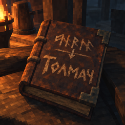

<div align="center">



# Tolmach

Русский перевод для 37 модов Valheim, которые ObeliskRU не переводит или переводит частично.

[](https://github.com/Muratovnik/Tolmach/releases)
[](LICENSE)

</div>

Tolmach — плагин BepInEx, названный по старинному русскому слову «толмач»
(переводчик). Он работает рядом с ObeliskRU и переводит то, что остаётся английским:
подписи интерфейса, подсказки, сообщения, названия предметов и навыков.

## Возможности

- Переводит 37 модов: 24 без русского перевода и 13 переведённых частично. Список с
  версиями — в [описании пакета](package/README.md#переводимые-моды), что именно
  переведено в каждом моде — в [docs/COVERAGE.md](docs/COVERAGE.md).
- Дополняет ObeliskRU, а не заменяет его. Tolmach заполняет только отсутствующие и
  английские строки; уже существующий русский перевод, в том числе от ObeliskRU,
  остаётся.
- Меняет только текст на экране. Сохранения, рецепты, предметы и конфиги модов не
  затрагиваются. Мод нужен только на клиенте: серверу и другим игрокам его ставить не
  нужно.
- Отключает перевод отдельного мода или весь пакет в настройках BepInEx.
- Пишет отчёт о том, какие моды найдены и какие переводы подключены.

## Установка

> Tolmach проверен автоматическими тестами с библиотеками игры, BepInEx и Harmony.
> В самой игре на всех экранах его ещё не проверяли; о непереведённых местах сообщайте
> в [issues](https://github.com/Muratovnik/Tolmach/issues).

Нужны:

- Valheim с профилем в менеджере модов Gale или r2modman.
- BepInExPack_Valheim и JsonDotNET — это зависимости пакета. Gale доустанавливает их
  при импорте, если их нет в профиле.
- ObeliskRU — рекомендуется оставить включённым: Tolmach переводит только то, чего нет
  в ObeliskRU и в собственных переводах модов. Без ObeliskRU часть строк останется
  английской.

1. Скачайте `Muratovnik-Tolmach-<версия>.zip` из
   [последнего релиза](https://github.com/Muratovnik/Tolmach/releases/latest). Рядом
   лежит `SHA256SUMS`. Чтобы сверить хеш, выполните в папке загрузки
   (пример для 0.2.0):

   ```powershell
   (Get-FileHash .\Muratovnik-Tolmach-0.2.0.zip -Algorithm SHA256).Hash.ToLower()
   Get-Content .\SHA256SUMS
   ```

   Первая строка вывода должна совпасть с хешем в `SHA256SUMS`.

2. Импортируйте ZIP в менеджер модов:
   - **Gale:** «Импорт» → «…локальный мод» и выберите ZIP, или перетащите ZIP в окно
     Gale. Файлы появятся в папке профиля `BepInEx/plugins/Tolmach/`. Повторный
     импорт новой версии заменяет прежнюю.
   - **r2modman:** Settings → Import local mod. Этот путь не проверялся.
   - **Вручную:** скопируйте содержимое папки `plugins` из архива в
     `BepInEx/plugins/Tolmach/` так, чтобы `Tolmach.dll` и папка `catalog` лежали рядом.

На thunderstore.io пакет пока не опубликован.

## Первый запуск

1. Запустите Valheim через менеджер модов.
2. В настройках игры выберите русский язык.
3. Откройте окно или предмет одного из переводимых модов: текст должен быть на
   русском.

После запуска в папке профиля появляются два файла:

- `BepInEx/config/muratovnik.tolmach.cfg` — настройки. Параметры описаны в
  [описании пакета](package/README.md#настройки); изменения применяются после
  перезапуска игры.
- `BepInEx/config/Tolmach.runtime.txt` — отчёт. Строка `Russian active: True`
  означает, что перевод включён. Ниже — строка по каждому найденному моду и причина
  пропуска для модов, которых нет в профиле.

## Документация

- [package/README.md](package/README.md) — описание пакета, которое показывает менеджер
  модов: список модов и версий, настройки, удаление.
- [docs/COVERAGE.md](docs/COVERAGE.md) — что переведено в каждом моде.
- [docs/ARCHITECTURE.md](docs/ARCHITECTURE.md) — как плагин находит и подменяет текст.
- [docs/BUILD.md](docs/BUILD.md) — сборка, изменение переводов и выпуск версий.
- [docs/VALIDATION.md](docs/VALIDATION.md) — что проверено и что нет.
- [docs/RUNTIME-CHECKLIST.md](docs/RUNTIME-CHECKLIST.md) — план проверки в игре.
- [CHANGELOG.md](CHANGELOG.md) — изменения по версиям.

## Ограничения

- Не переводятся: команды и вывод консоли, окно настроек F1, пользовательские
  конфиги и имена, которые вводит игрок.
- Перехват экранного текста привязан к версиям модов из списка. Если у мода другая
  версия, словарные переводы продолжают работать, а экранные по умолчанию
  отключаются. Включить их можно параметром `Compatibility.AllowOtherVersions`, но
  работа с другими версиями не проверялась.
- Ошибки самих модов пакет не исправляет.

## Участие в разработке

О непереведённой строке сообщайте в [issues](https://github.com/Muratovnik/Tolmach/issues).
Укажите точную английскую строку, мод и его версию, экран, где она видна, и строки
этого мода из `Tolmach.runtime.txt`. Сборка, правка переводов и выпуск описаны в
[docs/BUILD.md](docs/BUILD.md).

## Лицензия

[MIT](LICENSE) — для кода пакета и новых русских переводов. Оригинальные английские
строки, названия и идентификаторы модов принадлежат их авторам.
