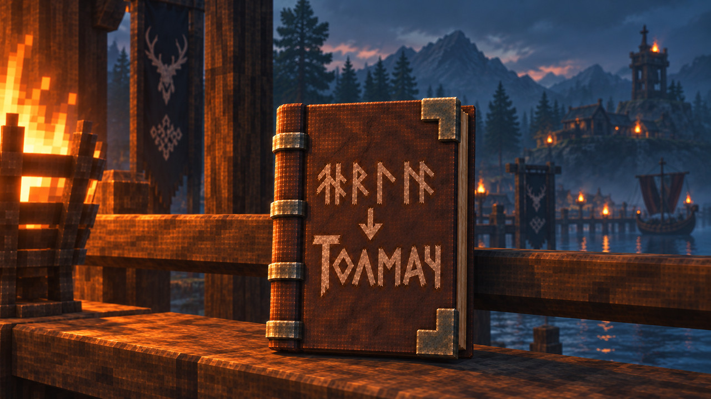

# Tolmach

Русский перевод для модов Valheim и звуковых субтитров игры.

[Моды](package/README.md#переводимые-моды) · [Установка](#установка) · [Документация](#документация) · [Сообщить об ошибке](https://github.com/Muratovnik/Tolmach/issues/new)

Tolmach переводит подписи интерфейса, подсказки, сообщения, названия предметов, существ и навыков. В пакете — переводы и дополнения для **90 модов**, а также звуковые субтитры Valheim 1.0.16. В одних модах переведены основные окна и предметы, в других — только недостающие строки или сообщения о версиях: [подробное покрытие](docs/COVERAGE.md).

Пакет работает самостоятельно и устанавливается только у игрока. Серверу и другим участникам Tolmach не нужен.

## Возможности

Tolmach меняет отображение текста, не сохранения, рецепты и значения настроек других модов. Существующий русский перевод обычно сохраняется; исключение — три явных исправления Missing Pieces. Перевод отдельного мода можно отключить, оставив остальные включёнными.

Например, описание оружия Humanoid Randomizer `A simple bow.` переводится как «Простой лук.». Составные подсказки могут содержать строки нескольких модов — каждый исходный фрагмент переводится отдельно, без повторной замены уже переведённого текста.

## Установка

В Gale или r2modman откройте профиль Valheim, найдите **Tolmach** в каталоге Thunderstore и установите его. Менеджер установит зависимости BepInExPack_Valheim и JsonDotNET.

[Страница на Thunderstore](https://thunderstore.io/c/valheim/p/Muratovnik/Tolmach/) · [Установка из ZIP и проверка хеша](docs/INSTALLATION.md#установка-из-архива)

## Первый запуск

1. Запустите Valheim через менеджер и выберите русский язык.
2. Если язык был другим, полностью перезапустите игру: некоторые моды создают свои подписи при запуске.
3. Откройте окно переводимого мода или наведите курсор на его предмет. Для обычного использования не требуется читать отчёт или редактировать конфиг.

[Перевод не появился](docs/INSTALLATION.md#диагностика) · [Настройки](package/README.md#настройки)

## Документация

### Игрокам

| Документ | Что можно узнать |
|---|---|
| [Карточка мода](package/README.md) | Список модов, установка, настройки и помощь; этот README входит в пакет Thunderstore. |
| [Что переведено](docs/COVERAGE.md) | Объём перевода и ограничения для каждого мода. |
| [Установка и диагностика](docs/INSTALLATION.md) | Импорт ZIP, ручная установка, проверка хеша и чтение отчёта. |
| [Что изменилось](CHANGELOG.md) | Итоговые изменения публичных выпусков. |

### Авторам переводов и разработчикам

| Документ | Что в нём |
|---|---|
| [Сборка и изменение переводов](docs/BUILD.md) | Зависимости разработки, команды проверок и выпуск пакета. |
| [Архитектура](docs/ARCHITECTURE.md) | Как строки доходят до экрана и где проходит граница перевода. |
| [Источники текстов](docs/SOURCES.md) | Происхождение переводов, терминология и воспроизводимость проверок. |
| [Статус проверки](docs/VALIDATION.md) | Что подтверждают сохранённые результаты и чего они не доказывают. |
| [Приёмка в игре](docs/RUNTIME-CHECKLIST.md) | Сценарии проверки интерфейса, языков, сочетаний модов и производительности. |

## Ограничения

Игровая приёмка финальной сборки ещё не подтверждена. Автоматические проверки каталогов и адаптеров не заменяют проверку текста на экранах.

Имена консольных команд, технические идентификаторы и произвольные пользовательские конфиги не переводятся. Интерфейс Configuration Manager переведён; названия разделов и параметров других модов в F1 в общем случае остаются как есть. Поддерживаемые настройки Creature Level and Loot Control — исключение. После смены языка нужен перезапуск.

Точные фразы не содержат сведений об авторе: совпавшая пользовательская надпись может отображаться переведённой, хотя её сохранённое значение не меняется. Шаблоны имён Humanoid Randomizer ограничены объектами этого мода, а не всеми строками локализации. [Подробности совместимости](package/README.md#совместимость-и-ограничения).

На других версиях модов Tolmach пробует известные строки; предупреждения об адресных адаптерах не являются полным списком всех непереведённых мест. Ошибки игровой логики сторонних модов не исправляются.

## Участие в разработке

Нашли английский текст или неудачную формулировку? [Сообщите об ошибке](https://github.com/Muratovnik/Tolmach/issues/new): укажите мод и его версию, место появления текста и приложите скриншот либо скопируйте строку. Отчёт Tolmach можно приложить дополнительно, но для замечания о переводе он не обязателен.

Для изменения каталогов или кода начните с [руководства по сборке](docs/BUILD.md). В PR укажите, какие проверки выполнены, а какие требуют игрового профиля; номер каталога или число тестов не заменяют эту информацию.

## Благодарности

«Толмач» — старинное слово со значением «переводчик». Пакет вдохновлён [ObeliskRU](https://thunderstore.io/c/valheim/p/DragonMotion/ObeliskRU/): он помог определить, какие моды и строки требуют перевода. Русские тексты подготовлены заново по исходным текстам модов; [источники](docs/SOURCES.md).

## Лицензия

[MIT](LICENSE).
